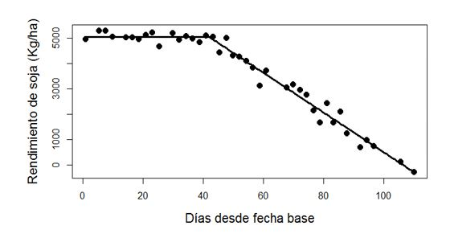
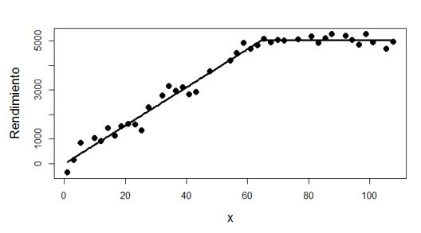
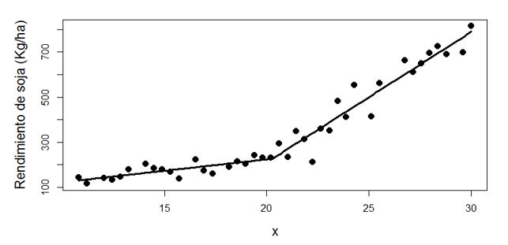
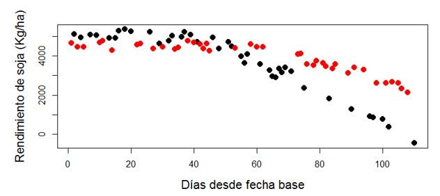
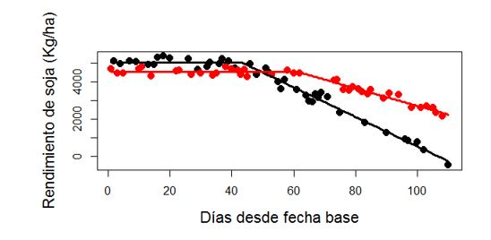

<h2 style="text-align:center; color:#2c3e50; font-family:'Segoe UI', Tahoma, Geneva, Verdana, sans-serif; font-size: 24px; margin-bottom: 30px;">
  📈 Ajuste de Modelos Bi-lineales con Punto de Quiebre no Pre-establecido
</h2>

Los modelos lineales con quiebre hacer referencia a una relacion lineal entre dos variables donde la pendiente cambia en algn punto de la relación, este es el punto de quiebre. Por ejemplo, se sabe que el rendimiento de soja disminuye al atrasar la fecha de siembra; si bien la relación es lineal, el atraso de la fecha de siembra no parece afectar demasiado al rinde en un principio, pero a partir de un momento dado, las pérdidas siguen una tendencia lineal. En casos donde el punto de quiebre es conocido, el modelo se puede ajustar mediante un modelo lineal múltiple. Sin embargo, en muchas situaciones, este punto es desconocide y encontrar uan estimacion de este valor es uno de los problemas a responder. En estas situaciones el modelo se convierte en un modelo no lineal y trae aparejados diversas compliccacione en su ajuste. A continuación se presentan ejemplos de aplicacion de estas modelos en R.  

<h2 style="color:#34495e; font-family:'Segoe UI', Tahoma, Geneva, Verdana, sans-serif; font-size: 24px; margin-top: 40px;">
  🔹 Modelos Lineal Plató o Meseta
</h2>

<h3 style="color:#2d3436; font-family:'Segoe UI', Tahoma, Geneva, Verdana, sans-serif; font-size: 20px; margin-top: 30px;">
   ▪️ Modelo con Plató en la Izquierda
</h3>

En muchos fenómenos biológicos, el uso de modelos lineales con quiebre resulta una simplificación muy útil de la relación entre variables. Por ejemplo, se sabe que el rendimiento de soja disminuye al atrasar la fecha de siembra; sin embargo, esta disminución no es lineal, sino que el atraso de la fecha de siembra no parece afectar demasiado al rinde en un principio, pero a partir de un momento dado las pérdidas siguen una tendencia lineal. En este caso, determinar el punto a partir del cual los rindes empiezan a ser afectados así como conocer a qué tasa estos rindes van decreciendo una vez superado dicho punto de inflexión, son preguntas de alto interés agronómico.
En la figura Nº 1 se presenta un conjunto de datos simulados describiendo esta situación.  

<p align="center">
  
</p>

Figura 1: Rendimientos máximos de un cultivar de soja y la fecha de siembra expresada como días desde una fecha base.

En esta situación hay tres parámetros a estimar
- **dc**  día en el que se produce el quiebre de la tendencia
- **A**= nivel medio de rendimiento antes del día dc
- **p**= pérdida de rendimiento por día a partir del día dc. 

El modelo teórico que se propone para describir esta relación es: 

Si $días<d_c $ 

$$ 
Rend= A+\varepsilon 
$$

mientras que si $días \geq d_c$

$$
Rend= A+p\  d_c - p\  días + \varepsilon 
$$

(Ec. Nº 1)

El modelo de la Ec. Nº 1, es un modelo no lineal en los parámetros pues en algunos de sus términos a parece la multiplicación de algunos de ellos.
Por lo tanto la función que utilizaremos para ajustar este modelo es “nls” del paquete “stats” de R, que realiza una ajuste de mínimos cuadrados de un modelo no lineal.

```r
nls(rend ~ A + p * (dias - dc > 0) * (dias - dc),
start = list(A = 5000, p = -80, dc = 40),
data = dat1) -> nls1
```

En esta función, se debe explicitar:

1. La fórmula no lineal de la relación entre rendimiento y días. En este contexto, la expresión *(dias-dc>0)* genera una variable indicadora que vale 0 si días es menor a dc y 1 si días es mayor a dc.

2. Valores iniciales de los parámetros, en este caso los parámetros del modelos son fáciles de estimar desde la figura Nº 1. Un valor inicial para **dc** puede ser simplemente un valor de día donde se vea un quiebre en la relación. Un valor inicial para **A** puede ser un valor medio de los datos observados correspondientes a días anteriores al punto de quiebre. Un valor inicial para **p** puede ser una estimación de la pendiente en la segunda etapa del proceso, puede tomar la diferencia entre el rendimiento mínimo y el valor inicial de **A** (será un valor negativo en este caso) y dividirlo por la cantidad de días entre el punto de quiebre y el ultimo día con dato.
     
3. En un resumen de este modelo obtenemos estimaciones de los parámetros de interés, sus errores estándar , estadísticos t con sus respectivos valores p correspondientes a las hipótesis sobre si dicho parámetro es o no  distinto de cero, en muchos casos no es una prueba de interés biológico.

```r
summary(nls1)

Formula: rend ~ A + p * (dias - dc > 0) * (dias – dc)

Parameters:
   Estimate Std. Error t value Pr(>|t|)    
A  5032.314     61.628   81.66   <2e-16 ***
p   -78.240      2.650  -29.52   <2e-16 ***
dc   42.080      1.453   28.95   <2e-16 ***
Signif. Codes:  0 ‘***’ 0.001 ‘**’ 0.01 ‘*’ 0.05 ‘.’ 0.1 ‘ ’ 1

Residual standard error: 246.5 on 37 degrees of freedom
Number of iterations to convergence: 3
Achieved convergence tolerance: 2.413e-09
```
Además, a través de la función “confint”, podemos obtener intervalos de confianza para dichos parámetros.  

```r
confint(nls1,level = 0.90)
Waiting for profiling to be done...
           5%        95%
A  4928.77651 5136.99471
p   -82.72798  -73.87073
dc   39.59749   44.42159
```

La interpretación de estos intervalos sería, el punto de quiebre a partir del cual se producen pérdidas en el rendimiento de soja, con un 90% de confianza, está entre 40 y 44 días posteriores a la fecha base. Previo a esta fecha crítica el rendimiento medio de este cultivar de soja se encuentra, con un 90% de confianza, entre 4929 y 5137 Kg/ha y a partir de esa fecha, con un 90% de confianza, la pérdida promedio por día de atraso en la siembra está entre 82.7 y 73.9 Kg/ha.
En la Figura Nº 2 se muestra el modelo ajustado, y fue obtenida con las siguientes sentencias:

```r
plot(rend ~ dias, pch=20, cex=2, data=dat1,
     ylab="Rendimiento de soja (Kg/ha)",
     xlab="Días desde fecha base", cex.lab=1.4)
lines(min(dat1$dias):max(dat1$dias),
      predict(nls1,
         newdata=data.frame(dias=min(dat1$dias):max(dat1$dias))),
      lwd=3)
```
<p align="center">
  
</p>

Figura Nº 2: Rendimientos máximos de un cultivar de soja y la fecha de siembra expresada como días desde una fecha base. Línea negra continua es el modelo lineal plató ajustado.

**Modelo con Plató en la Derecha**

En el caso de querer ajustar un modelo lineal plató, con el plató en el lado derecho, como el que se muestra en la figura Nº 3, sólo se debe cambiar muy poco la sentencia que ajusta el modelo:

```r
nls(y ~ A+ p*(x-dc<0)*(x-dc),data=dat2,
    start=list(A=5000,p=+80, dc=75)) -> nls2
```

La expresión (dias-dc< 0), es lo único que ha cambiado respecto al modelo anterior y genera ahora una variable indicadora que vale 0 si días es mayor a dc y 1 si días es menor a dc. Ahora el valor inicial de p debe ser positivo pues es una estimación de la pendiente en el tramo inicial del modelo.


<p align="center">
  
</p>

Figura Nº 3: Rendimientos máximos de un cultivar de soja y una variable x explicativa. Línea negra continua es el modelo lineal plató ajustado.

```r
summary(nls2)
Formula: rend ~ A + p * (dias - dc < 0) * (dias – dc)
Parameters:
   Estimate Std. Error t value Pr(>|t|)    
A  5032.314     61.498   81.83   <2e-16 ***
p    77.936      2.665   29.25   <2e-16 ***
dc   64.661      1.534   42.16   <2e-16 ***
---Signif. Codes:  0 ‘***’ 0.001 ‘**’ 0.01 ‘*’ 0.05 ‘.’ 0.1 ‘ ’ 1

Residual standard error: 246 on 37 degrees of freedom
Number of iterations to convergence: 4
Achieved convergence tolerance: 2.608e-09


confint(nls2,level = 0.95)
Waiting for profiling to be done...
         2.5%      97.5%
A  4906.31855 5158.50007
p    72.77161   83.83937
dc   61.33390   67.80044
```

Para obtener la Figura Nº 3, la sentencia es similar a la anterior:

```r
plot(y ~ x, pch=20, cex=2, ylab="Rendimiento de soja (Kg/ha)",
     xlab="x", cex.lab=1.4, data=dat2)
lines(seq(min(dat2$x),max(dat2$x), length=200),
      predict(nls2,
              newdata=data.frame(
                     x=seq(min(dat2$x),max(dat2$x),length=200))),
      lwd=3)
```
<h2 style="color:#34495e; font-family:'Segoe UI', Tahoma, Geneva, Verdana, sans-serif; font-size: 24px; margin-top: 40px;">
  🔹 Modelo bi lineal con quiebre en la pendiente.
</h2>

Otros modelos bi lineales que suelen ser de interés, son aquellos donde la variable respuesta y tiene una relación lineal con otra variable explicativa x, pero cuya relación tiene un punto de quiebre. Es decir, a partir de un cierto valor de x la pendiente de la recta cambia. Como por ejemplo la relación mostrada en la Figura Nº 4.

<p align="center">
  
</p>

Figura Nº 4: Relación bi-lineal con quiebre de pendiente entre las variables x e y.
En estos casos el modelo lineal que describe la situación es:

El modelo teórico que se propone para describir esta relación es: 

Si $x \leq c$

$$ 
y= A+b_1 \ (x-c) + \varepsilon 
$$

mientras que si $x \geq c$

$$
y= A+(b_1+b_2) \ (x-c)  + \varepsilon 
$$


(Ec. Nº 2)

En esta situación hay cuatro parámetros a estimar:
**c**= valor de x donde se produce el cambio de pendiente
**A**= nivel medio de rendimiento antes del día c
**b1** = cambio en y por un cambio unitario en el valor de x antes del punto de quiebre
**b2** = cambio en y por un cambio unitario en el valor de x después del punto de quiebre.

Para los datos de la Figura Nº 4 se ajustó el siguiente modelo:

```r 
nls(y ~ a + b1*(x-c)+b2*(x-c>0)*(x-c), data=dat ,            
    start=list(a=230,b1=14,b2=50, c=20)) -> nls3
```

Donde A, b1 y c tienen las mismas interpretaciones que las mencionadas antes, mientras que b2 es ahora el cambio que se produce en la pendiente al pasar el umbral x=c, es decir, la pendiente del modelo a partir de x=c es (b1+b2).

En un resumen de este modelos vemos:

```r

summary(nls3)
Formula: y ~ a + b1 * (x - c) + b2 * (x - c > 0) * (x - c)
Parameters:
   Estimate Std. Error t value Pr(>|t|)    
a  226.6890    22.6346  10.015 5.97e-12 ***
b1  10.1450     3.3733   3.007  0.00478 **
b2  47.7609     4.7278  10.102 4.73e-12 ***
c   20.2709     0.5479  36.994  < 2e-16 ***
---
Signif. codes:  0 ‘***’ 0.001 ‘**’ 0.01 ‘*’ 0.05 ‘.’ 0.1 ‘ ’ 1

Residual standard error: 43.64 on 36 degrees of freedom
Number of iterations to convergence: 3
Achieved convergence tolerance: 7.145e-08

```

La ventaja de esta nueva parametrización es que en el resumen, además de obtener las estimaciones de los parámetros y sus errores estándares, se prueba la hipótesis sobre si el parámetro b2 es  distinto de cero o no, esto nos dice si es significativo el cambio de pendiente en el modelo o un modelo lineal común es suficiente para describir los datos, en este caso  vemos que el cambio de pendiente es significativo (p =4.73e-12).

Los intervalos del 99% confianza de este modelo se pueden obtener con:

```r

confint(nls3, level=0.99)
Waiting for profiling to be done...
         0.5%     99.5%
a  151.098399 316.02828
b1  -2.272925  19.85207
b2  34.903722  60.61799
c   18.237974  22.33863

```
<h2 style="color:#34495e; font-family:'Segoe UI', Tahoma, Geneva, Verdana, sans-serif; font-size: 24px; margin-top: 40px;">
  🔹 Modelos lineal plató simultáneos para distintos grupos de datos.
</h2>

En el ejemplo presentado al iniciar el tutorial, mencionamos que se sabe que el rendimiento de soja disminuye al atrasar la fecha de siembra, sin embargo, esta disminución puede ser distinta según el cultivar de soja que se utilice. En la Figura Nº 5 se presentan los datos de dos cultivares de soja distintos en su relación con la fecha de siembra medida como días desde un día base.

<p align="center">
  
</p>

Figura Nº 5: Rendimientos máximos de dos cultivares de soja y la fecha de siembra expresada como días desde una fecha base. Puntos negros cultivar “A” y puntos rojos cultivar ”B”.

```r

nls(rend ~ A[cultivar]+
           p[cultivar]*(dias-dc[cultivar]>0)*(dias-dc[cultivar]),
    start=list(A=c(5000,4500),p=c(-80,-40), dc=c(45,50))) -> nls4


summary(nls4)
Formula: rend ~ A[cultivar] + p[cultivar]*
               (dias - dc[cultivar] > 0) * (dias - dc[cultivar])
Parameters:
    Estimate Std. Error t value Pr(>|t|)    
A1  5034.287     46.734  107.72   <2e-16 ***
A2  4520.444     42.049  107.50   <2e-16 ***
p1   -78.871      2.159  -36.53   <2e-16 ***
p2   -46.676      3.470  -13.45   <2e-16 ***
dc1   43.097      1.106   38.96   <2e-16 ***
dc2   61.270      2.368   25.87   <2e-16 ***
---
Signif. codes:  0 ‘***’ 0.001 ‘**’ 0.01 ‘*’ 0.05 ‘.’ 0.1 ‘ ’ 1

Residual standard error: 192.7 on 74 degrees of freedom
Number of iterations to convergence: 4
Achieved convergence tolerance: 4.486e-09

confint(nls4,level = 0.90)
Waiting for profiling to be done...
            5%        95%
A1  4956.44155 5112.13334
A2  4449.71717 4592.19380
p1   -82.46759  -75.27474
p2   -53.59895  -40.92924
dc1   41.20463   44.88233
dc2   56.90056   65.54673

```

Para obtener el gráfico que se presenta en la figura Nº 6 se utilizaron las siguientes sentencias:

```r

coef(nls4) -> coe
plot( rend ~ dias, data=dat4, pch=20, cex=2, cex.lab=1.4,
      col=unclass(cultivar), xlab="Días desde fecha base",
      ylab="Rendimiento de soja (Kg/ha)")
lines(xx <- seq(min(dat4$dias),max(dat4$dias), length=200),
      ifelse(xx < coe[5], coe[1], coe[1]+coe[3]*(xx-coe[5])),
      lwd=3)
lines(xx,
      ifelse(xx < coe[6], coe[2], coe[2]+coe[4]*(xx-coe[6])),
     lwd=3, col="red")
     
```

<p align="center">
  
</p>

Figura Nº 6: Rendimientos máximos de dos cultivares de soja y la fecha de siembra expresada como días desde una fecha base y sus modelos ajustados. Negros cultivar “A”, rojos cultivar ”B”.

*Todos los análisis y gráficos de este documento fueron realizados en R, versión 3.1.0 (2014-04-10). R Core Team (2014). R: A language and environment for statistical computing. R Foundation for Statistical Computing, Vienna, Austria. URL http://www.R-project.org/.*

