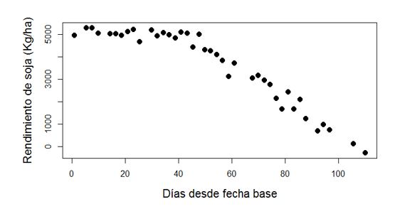
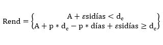

## Ajuste de modelos bi-lineales con punto de quiebre no pre-establecido

**Modelos lineal plató o meseta**

**Modelo con Plató en la Izquierda**

En muchos fenómenos biológicos, el uso de modelos lineales con quiebre resulta una simplificación muy útil de la relación entre variables. Por ejemplo, se sabe que el rendimiento de soja disminuye al atrasar la fecha de siembra; sin embargo, esta disminución no es lineal, sino que el atraso de la fecha de siembra no parece afectar demasiado al rinde en un principio, pero a partir de un momento dado las pérdidas siguen una tendencia lineal. En este caso, determinar el punto a partir del cual los rindes empiezan a ser afectados así como conocer a qué tasa estos rindes van decreciendo una vez superado dicho punto de inflexión, son preguntas de alto interés agronómico.
En la figura Nº 1 se presenta un conjunto de datos simulados describiendo esta situación.  

<p align="center">
  
</p>

Figura 1: Rendimientos máximos de un cultivar de soja y la fecha de siembra expresada como días desde una fecha base.

En esta situación hay tres parámetros a estimar
- **dc**  día en el que se produce el quiebre de la tendencia
- **A**= nivel medio de rendimiento antes del día dc
- **p**= pérdida de rendimiento por día a partir del día dc. 

El modelo teórico que se propone para describir esta relación es:

<p align="center">
  
</p>

(Ec. Nº 1)

El modelo de la Ec. Nº 1, es un modelo no lineal en los parámetros pues en algunos de sus términos a parece la multiplicación de algunos de ellos.
Por lo tanto la función que utilizaremos para ajustar este modelo es “nls” del paquete “stats” de R, que realiza una ajuste de mínimos cuadrados de un modelo no lineal.

```r
nls(rend ~ A + p * (dias - dc > 0) * (dias - dc),
start = list(A = 5000, p = -80, dc = 40),
data = dat1) -> nls1
```

En esta función, se debe explicitar:

1)	la fórmula no lineal de la relación entre rendimiento y días. En este contexto, la expresión *(dias-dc>0)* genera una variable indicadora que vale 0 si días es menor a dc y 1 si días es mayor a dc.

2)	valores iniciales de los parámetros, en este caso los parámetros del modelos son fáciles de estimar desde la figura Nº 1. Un valor inicial para **dc** puede ser simplemente un valor de día donde se vea un quiebre en la relación. Un valor inicial para **A** puede ser un valor medio de los datos observados correspondientes a días anteriores al punto de quiebre. Un valor inicial para **p** puede ser una estimación de la pendiente en la segunda etapa del proceso, puede tomar la diferencia entre el rendimiento mínimo y el valor inicial de **A** (será un valor negativo en este caso) y dividirlo por la cantidad de días entre el punto de quiebre y el ultimo día con dato.
   
3)	En un resumen de este modelo obtenemos estimaciones de los parámetros de interés, sus errores estándar , estadísticos t con sus respectivos valores p correspondientes a las hipótesis sobre si dicho parámetro es o no  distinto de cero, en muchos casos no es una prueba de interés biológico.

```r
summary(nls1)

Formula: rend ~ A + p * (dias - dc > 0) * (dias – dc)

Parameters:
   Estimate Std. Error t value Pr(>|t|)    
A  5032.314     61.628   81.66   <2e-16 ***
p   -78.240      2.650  -29.52   <2e-16 ***
dc   42.080      1.453   28.95   <2e-16 ***
Signif. Codes:  0 ‘***’ 0.001 ‘**’ 0.01 ‘*’ 0.05 ‘.’ 0.1 ‘ ’ 1

Residual standard error: 246.5 on 37 degrees of freedom
Number of iterations to convergence: 3
Achieved convergence tolerance: 2.413e-09
```

